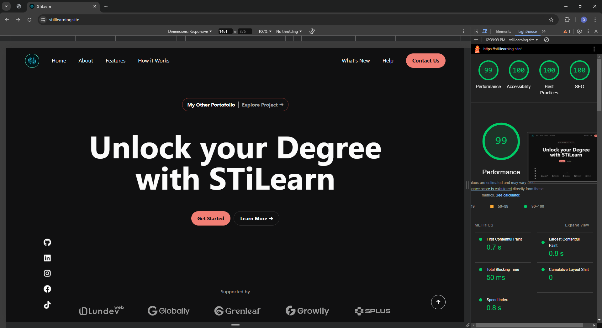
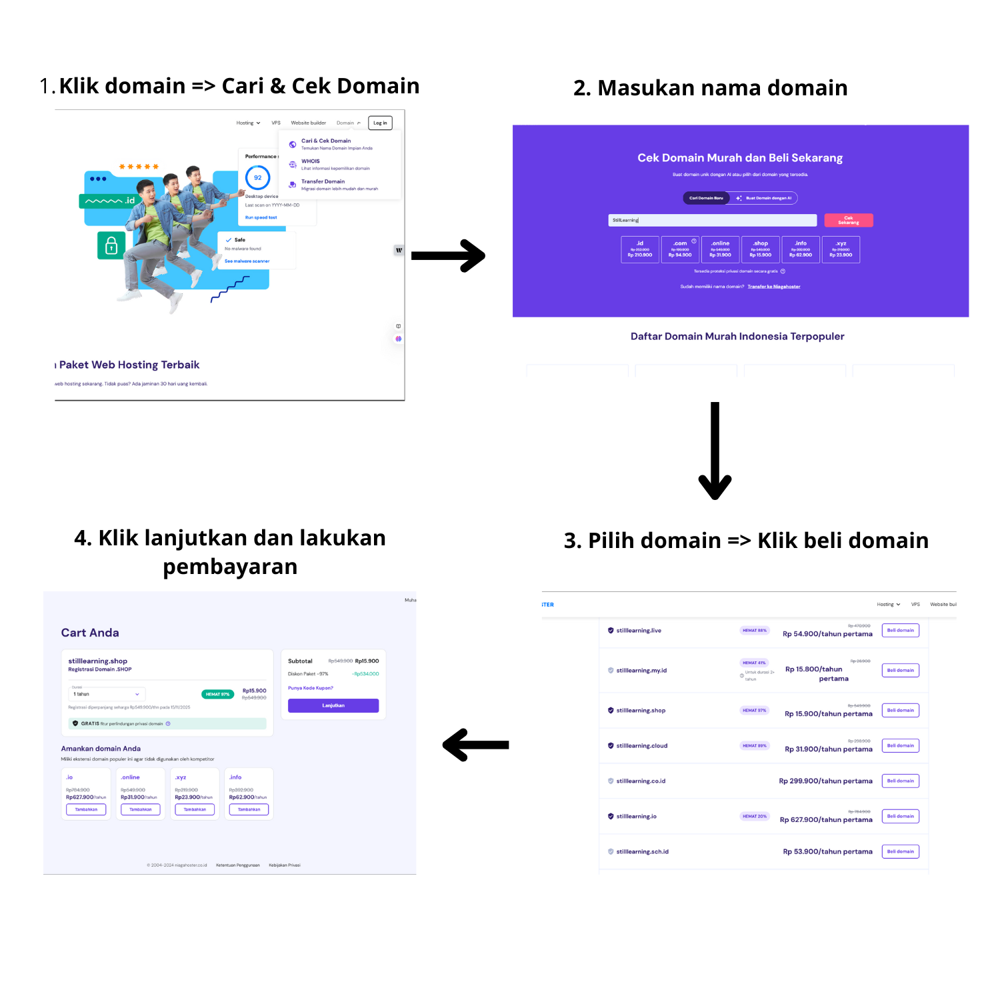

[](https://classroom.github.com/a/dyiPpHu0)

# 👋 Introduction

Hello! My name is **Muhammad Syifa Surya Saputra**, a Front-End Developer with a strong passion for creating digital experiences that are user-friendly, efficient, and accessible. I'm currently focusing on enhancing my skills in Software Engineering, particularly front-end development, and continuously learning to improve my craft. This website is a personal portfolio showcasing my skills, projects, and journey as a developer.

- **Email**: syifamuhammad3139@example.com
- **LinkedIn**: [LinkedIn Profile](https://www.linkedin.com/in/muhammadsyifasuryasaputra/)
- **GitHub**: [GitHub Profile](https://github.com/Muhammadsyifasurya)

---

## 🌐 About This Website

This website serves as a portfolio to display my work, technical skills, and accomplishments. The site is designed to provide visitors with an intuitive and clean experience while browsing my background, projects, and contact information. It also serves as an introduction to my expertise and future goals in the tech industry. [View the live version here](https://stilllearning.site/)

### Key Features

- **Responsive Design**: The website adapts seamlessly to various screen sizes, ensuring an optimal experience across devices.
- **Social Media Integration**: Links to my social media profiles such as GitHub, LinkedIn, Instagram, Facebook, and TikTok.
- **Back to Top Button**: A button that allows users to quickly navigate to the top of the page.
- **Footer Section**: Provides contact information, services, and legacy details about the company.

## 🗂 Website Structure

The website is organized into several key sections:

1. **Header**: Contains the main navigation links and branding.
2. **About Section**: Brief overview of who I am and my technical background.
3. **Projects Section**: Display of my key projects with brief descriptions and links to GitHub repositories.
4. **Contact Section**: Provides links to my social media profiles and other contact methods.
5. **Footer**: Contains company details, services, and legacy information.

## 🛠 Tools Used

- **Text Editor**: Visual Studio Code
- **Version Control**: Git, GitHub
- **Figma**: For UI/UX design mockups

## 🧑‍💻 Technologies Used

- **HTML5**: Structuring the content and elements of the website.
- **CSS3**: Styling the website with a responsive layout and animations.
- **Tailwind CSS**: A utility-first CSS framework to build custom styles quickly and efficiently.
- **JavaScript**: For interactive features like smooth scrolling and dynamic content.
- **Font Awesome**: For the social media icons used across the site.

## 📝 Semantic Implementation

The website follows semantic HTML principles for better accessibility and SEO optimization. Here are a few key practices implemented:

- **`<header>`**: Defines the header section with the main navigation links.
- **`<nav>`**: Contains the navigation links for easy access to different sections.
- **`<main>`**: Encompasses the primary content of the website.
- **`<section>`**: Used for distinct content areas like About, Projects, and Contact.
- **`<footer>`**: Marks the footer section that contains site-wide information and links.
- **`<ul>`**, **`<li>`**: Used for lists, such as services and contact methods.

## 🎨 CSS Structure

- **Tailwind CSS**: Used for utility-based styling, allowing rapid development and customization of the website layout and appearance.
- **Responsive Layouts**: Media queries are used to ensure the website adapts to various screen sizes.
- **Animations**: Simple CSS transitions and hover effects are applied to enhance user interaction.
- **Custom Classes**: For more specific styles not covered by Tailwind, custom CSS classes are used to achieve the desired look.

## 🚀 Lighthouse Performance


This website has been tested using Google Lighthouse, and here are the results:

- **Performance**: 99
- **Accessibility**: 100
- **Best Practices**: 100
- **SEO**: 100

These results indicate that the website performs well across various metrics, including load speed, accessibility for users with disabilities, adherence to best practices, and SEO optimization.

### Why Performance is 99:

The Performance score of 99 reflects excellent load speed and overall user experience, but it is slightly impacted by render-blocking resources. Specifically, external CSS files (e.g., Tailwind CSS and FontAwesome) are blocking the first paint of the page, which can delay content visibility.

This minor delay in rendering is the primary reason the performance score is not a perfect 100, though the website still performs exceptionally well.

## ⚙️ How to Setup

To get this project running on your local machine, follow these steps:

1. **Clone the Repository**  
   Use the following command to clone the repository:

   ```bash
   git clone https://github.com/Muhammadsyifasurya/Nexcent.git
   ```

2. **Enter to the folder**

   ```bash
   cd Nexcent
   ```

3. **Open with Visual Studio Code**

   ```bash
   code .
   ```

## 🚀 Deployment Documentation

### 1. Registering and Setting Up Netlify


- **Register on Netlify**
- Visit [Netlify](https://www.netlify.com/) to create a new account.
- After registration, log in to your Netlify account.

### 2. Connecting Netlify to the GitHub Project


- **Deploying from GitHub**
- In the Netlify dashboard, click **Add New Site** > **Import an Existing Project**.
- Select **GitHub** as the source, authorize Netlify to access your GitHub account.
- Choose the repository to deploy and set the `main` branch as the auto-deployment source.
- Click **Deploy** to start the process.

### 3. Purchasing and Connecting a Domain to Netlify

#### a. Purchasing a Domain



- Purchase a domain from a provider like [Niagahoster](https://www.niagahoster.co.id/).
- In the Niagahoster dashboard, go to **Domain** > **Search & Check Domain**.
- Enter your desired domain, click **Check Now**, and select your custom domain.

#### b. Connecting the Domain to Netlify


- In Netlify, navigate to **Site Settings** > **Domain Management** > **Add a Domain**.
- Enter the purchased domain and verify it.

#### 3. Updating DNS Nameservers


- Copy the DNS nameservers provided by Netlify.
- Go back to Niagahoster, select **Manage** for your domain, and update the nameservers.
- Wait for the DNS changes to propagate. Your site will be accessible via your custom domain once completed.

### 4. Summary

- **Netlify**: Registration and auto-deployment setup completed.
- **GitHub**: GitHub repository connected for continuous deployment on Netlify.
- **Domain**: Custom domain purchased and DNS settings configured for Netlify.

---
